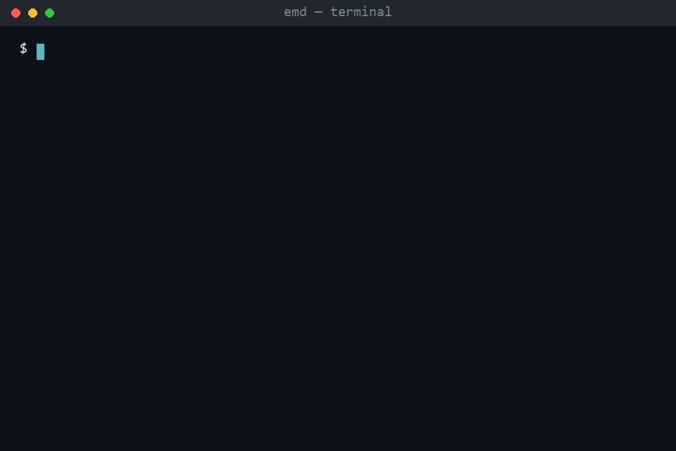

# emd

> Explain My Data — instant EDA reports from any CSV or Excel file.



## Why

Every new dataset starts with the same half-hour of boilerplate: check distributions, scan for missing values, eyeball correlations, hunt for outliers. `emd` runs that entire first pass in one command and turns it into a single Markdown report with charts, so you can skip straight to the interesting questions. It's built for data scientists and analysts who want a fast, repeatable first look at a file before opening a notebook. It also detects statistical drift between two datasets, which makes it useful for monitoring train/test splits or production data in an MLOps pipeline. No config, no setup beyond installing it — point it at a file and read the report.

## Install

```bash
git clone https://github.com/utkukosman1/explain-my-data-CLI.git
cd explain-my-data-CLI
pip install -e .
```

For Isolation Forest outlier detection (optional):

```bash
pip install -e ".[ml]"
```

## Quickstart

```bash
emd analyze data.csv
```

Produces `reports/<filename>/report.md` with embedded charts — distributions, correlations, missing values, outliers, and more, all in one file.

## What you get

| Section | What you get |
|:--------|:-------------|
| Data Quality Summary | FATAL/WARNING/INFO checks — empty data, high missing columns, duplicate rows, mixed types |
| Dataset Overview | Shape, dtypes, null counts, memory usage |
| Distribution Analysis | Mean, median, std, CV, skewness, kurtosis, normality test, percentiles, histogram + KDE, box plot |
| Correlation Analysis | Pearson & Spearman heatmaps, Cramér's V (categorical), point-biserial, VIF, strongest pairs table |
| Missing Value Analysis | Per-column missing %, missingness patterns, correlated missingness pairs |
| Outlier Detection | IQR, Z-score, Modified Z-score, optional Isolation Forest |
| Key Insights (Target) | Top correlated features + hue charts — only when `--target` is provided |

## More commands

```bash
emd analyze titanic.csv --target Survived    # feature importance vs. a target column
emd compare train.csv test.csv               # drift detection between two datasets
emd check data.csv                           # quality check only, no report
emd batch ./data/                            # analyze every CSV/XLSX in a directory
emd schema init data.csv                     # generate a YAML schema contract
```

See [docs/cli-reference.md](docs/cli-reference.md) for the full flag reference, and [docs/statistical-methods.md](docs/statistical-methods.md) for how each statistic and test is computed.

## Optional: web UI

A small companion UI (FastAPI + Next.js) exists for browser use — see [web/](web/README.md). It's not required to use `emd`.

## Development

```bash
pip install -e ".[dev]"
pytest tests/
ruff check src/ tests/
mypy src/emd
```

## License

MIT — see [LICENSE](LICENSE).
